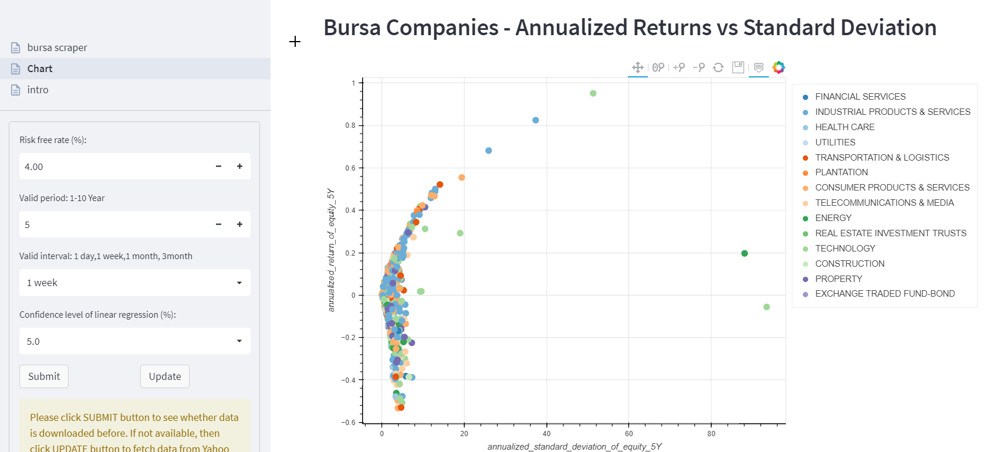
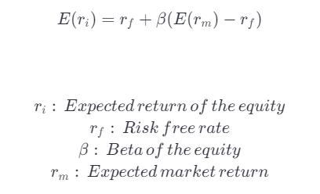
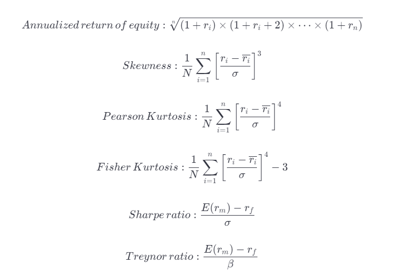

==============
Bursa Scraper
==============

Demo App here_: 

.. _here: https://tys203831-bursa-scraper-bursa-scraper-1okr1g.streamlitapp.com/

Introduction
----------------
This is a hobby project and is built for academic application of CAPM model in 
Bursa stock market. In any event, the project creator shall neither be liable
for any use of materials and data herein and nor promise the accuracy 
and completeness of the data.

Concept of the project
------------------------
This project aims to calculate beta, annualized return (or expected return), 
and some other performance metrics such as Sharpe ratio, Treynor ratio
of all Bursa equity using CAPM model as below:

Here is how some of the variables calculated in this project:

You may take reference with below YouTube video to know how to calculate some of the variables above in Excel:
        `Risk-adjusted performance evaluation - Sharpe, Treynor, and Jensen's Alpha (Excel)`_
        
.. _Risk-adjusted performance evaluation - Sharpe, Treynor, and Jensen's Alpha (Excel) : https://www.youtube.com/watch?v=zvChPqsKZjc&t=462s

How This Project is Built?
-----------------------------
I have spent about 2 weeks to build this project. This project is built using python
language, with some libraries installed such as `yfinance` to scrape yahoo finance
price history, `requests` to fetch stock tickers from i3investor website, `scipy`
to calculate beta using linear regression plot and  expected return using geometric
formula. Besides, `pandas` is used to handle, clean and process the data in tabular
structure and `bokeh` to plot simple `interactive charts`_ on this `streamlit` dashboard.

.. _interactive charts: https://tys203831-bursa-scraper-bursa-scraper-1okr1g.streamlitapp.com/Chart

Limitations of This Project
-------------------------------
We could not promise the accuracy of the data due to some technical inabilities. Below are some limitations:

1. **Data Inconsistency**

We scrape price data from a free website: Yahoo Finance. Thus, the server 
may return us certain WRONG PRICE variables mixed inside the our
scraped data if the server found us sending too much requests to get the data

2. **Not using T-bill yield history as risk free rate**

This project assumes the risk free rate input as a CONSTANT risk free rate history yield  
instead of Malaysian government bond yield. Currently, haven't yet explore website
that is easy to scrape for this information.

3. **Exclude Dividend in Stock Return & Beta Calculation**

This project does not include dividends when calculating stock return due to 
server constraints because the scraping process would be very slow if want to scrape dividend
data of all the bursa tickers.

4. **Potential Calculation Mistake**

Due to massive data and processes to be handled, I haven't yet cross-checked the calculation 
and thus honestly, the project is prone to errors. Also, this project uses other python 

Why I Build This Project?
-------------------------
I believe data should be easy for people to access for better information decision. 
During degree, I was troubled when picking which stocks or companies with certain criteria to 
be applied in finance or portfolio model.  And this shall be a starter project for that.

How to deploy this app locally?
-----------------------------------
1. Type ``git clone https://github.com/tys203831/bursa-scraper.git`` into terminal to download this folder to your directory
2. Go to this project directory: bursa-scraper, then type `streamlit run bursa_scraper.py` into terminal.

How to deploy this project to Streamlit Cloud?
---------------------------------------------------
1. Sign up a `streamlit cloud account`_.
2. Go to this `deploy page`_. Click "Paste GitHub URL"
3. Paste ``https://github.com/tys203831/bursa-scraper/blob/main/bursa_scraper.py`` to that column

.. _streamlit cloud account: https://streamlit.io/cloud
.. _deploy page: https://share.streamlit.io/deploy
